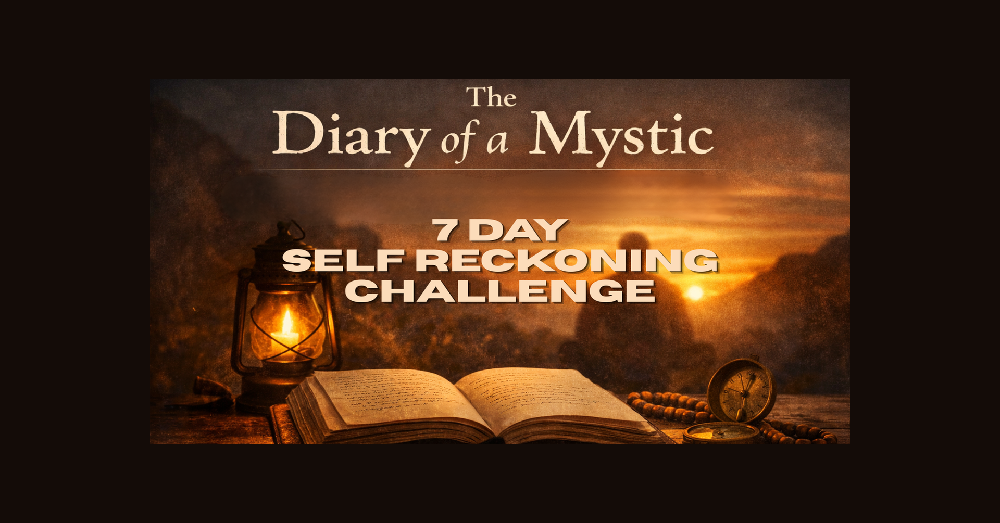
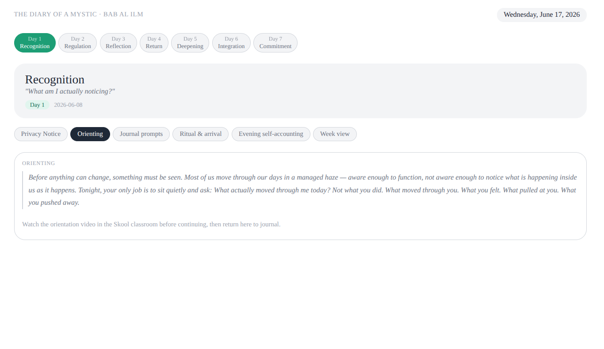
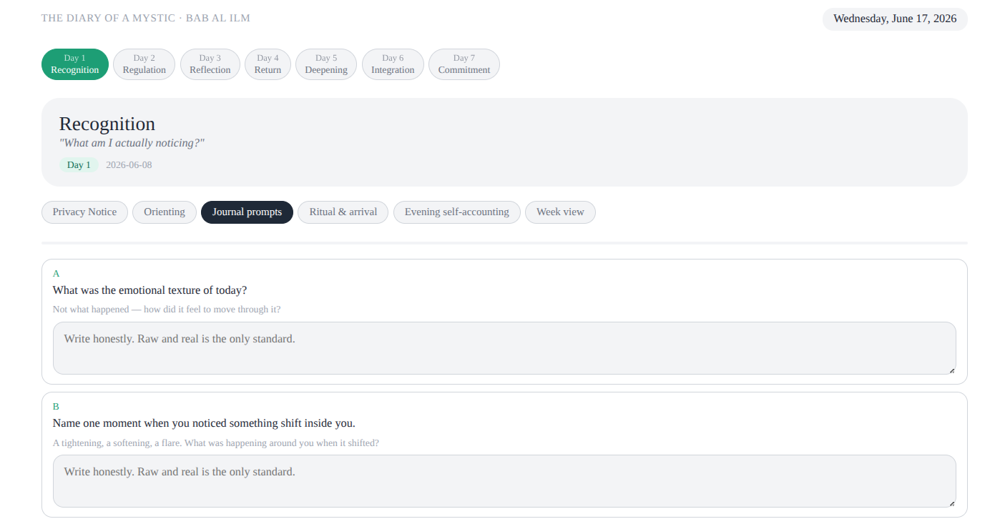
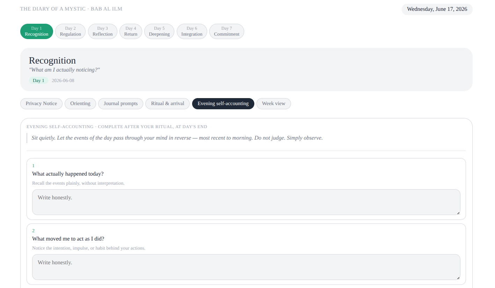
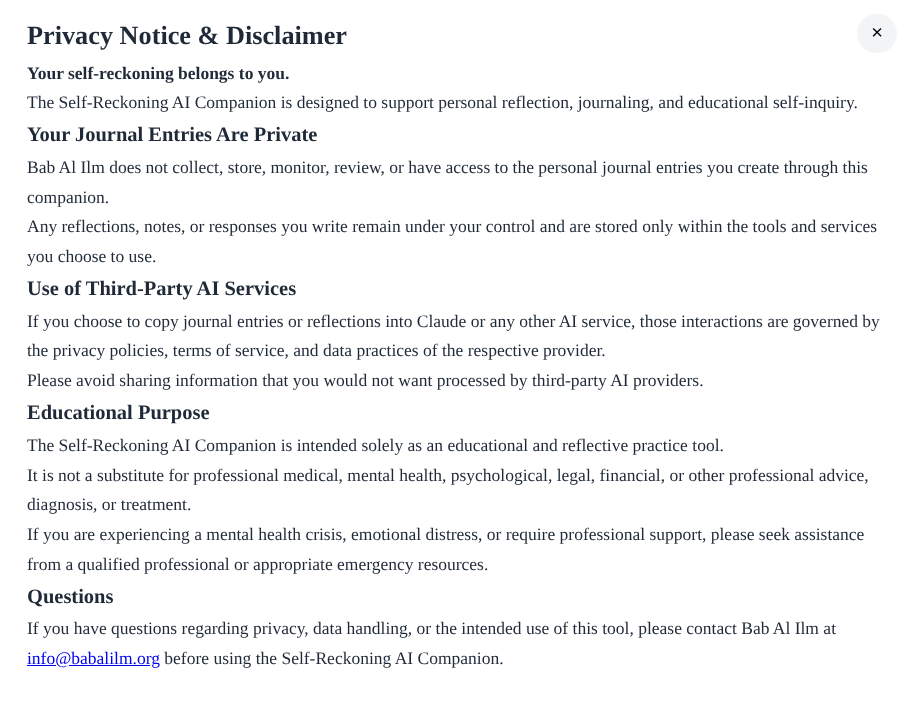

# Self-Reckoning AI Companion

A Claude-powered reflective learning companion developed for Bab Al Ilm's 7-Day Self-Reckoning Challenge.

## Overview

The Self-Reckoning AI Companion is a web-based reflective learning journal designed to support personal reflection, daily self-accounting, and behavior change.

It was developed as part of Bab Al Ilm's Self-Reckoning Method and tested during a live community challenge hosted through The Diary of a Mystic community.

## Live Site

https://antwanbabalilm.github.io/self-reckoning-ai-companion/

## Community

The Self-Reckoning AI Companion was developed as part of Bab Al Ilm's 7-Day Self-Reckoning Challenge.

Learn more about the challenge and community:

https://www.skool.com/self-reckoning-2713

## Features

* Seven-day guided reflection journey
* Daily journal prompts
* Evening self-accounting prompts
* Ritual and arrival practice
* Weekly review structure
* Privacy notice and disclaimer
* Claude-assisted reflection workflow

## Screenshots

### Orientation

### Journal Prompts

### Evening Self-Accounting

### Privacy Notice

## Privacy

Journal entries remain under the user's control.

Bab Al Ilm does not collect, store, monitor, review, or have access to personal journal entries created through this prototype.

If users choose to copy reflections into Claude or another AI service, those interactions are governed by that provider's privacy policies and account settings.

## Status

Pilot tested during Bab Al Ilm's 7-Day Self-Reckoning Challenge (June 2026).

This project is an active prototype and part of the ongoing development of The Diary of a Mystic and The Self-Reckoning Method..

## Organization

Bab Al Ilm -
The Diary of a Mystic -
The Self-Reckoning Method
